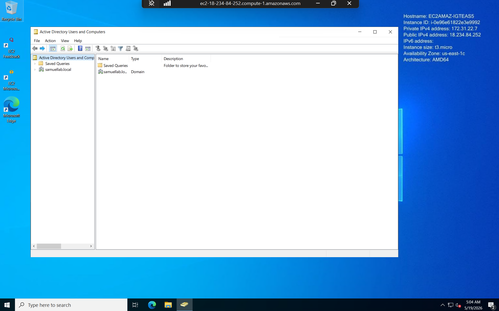
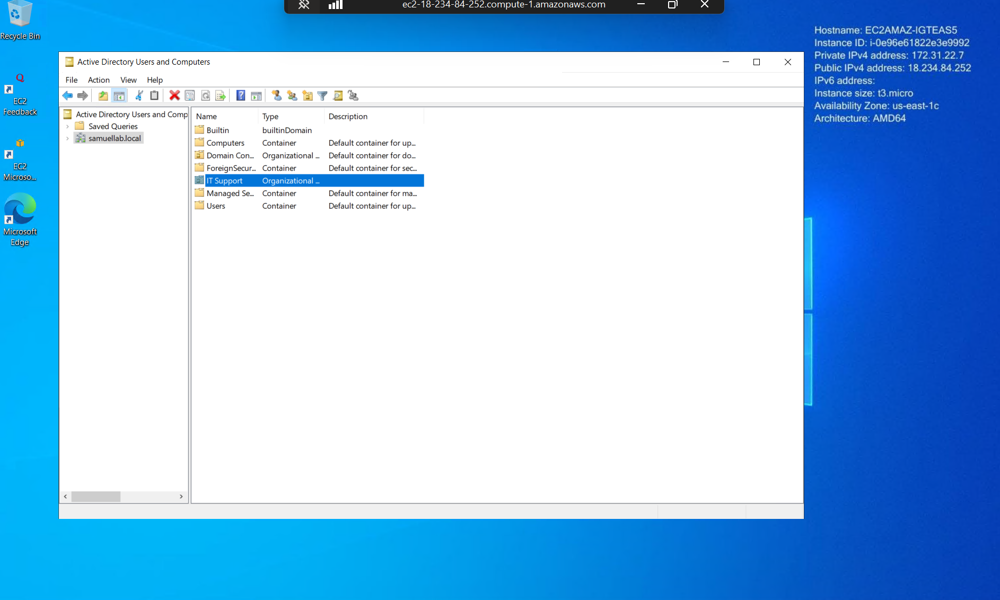
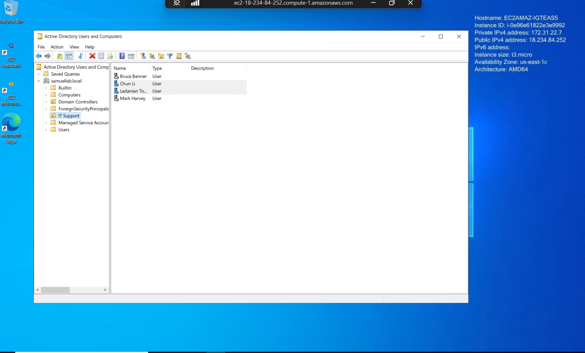
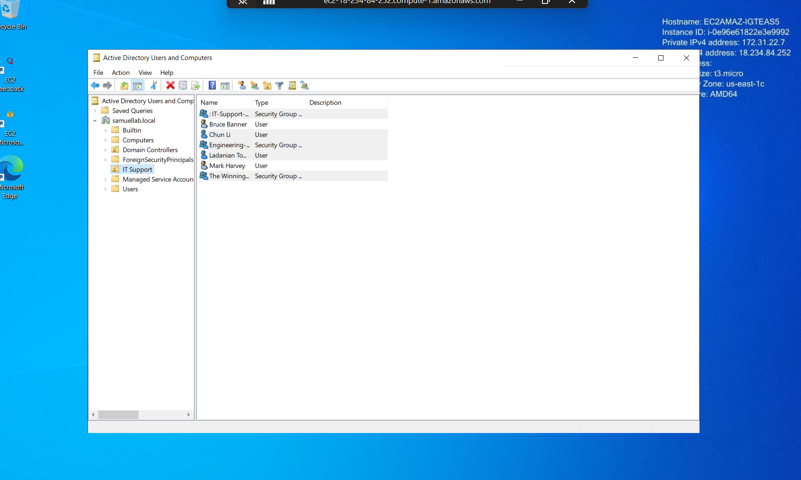
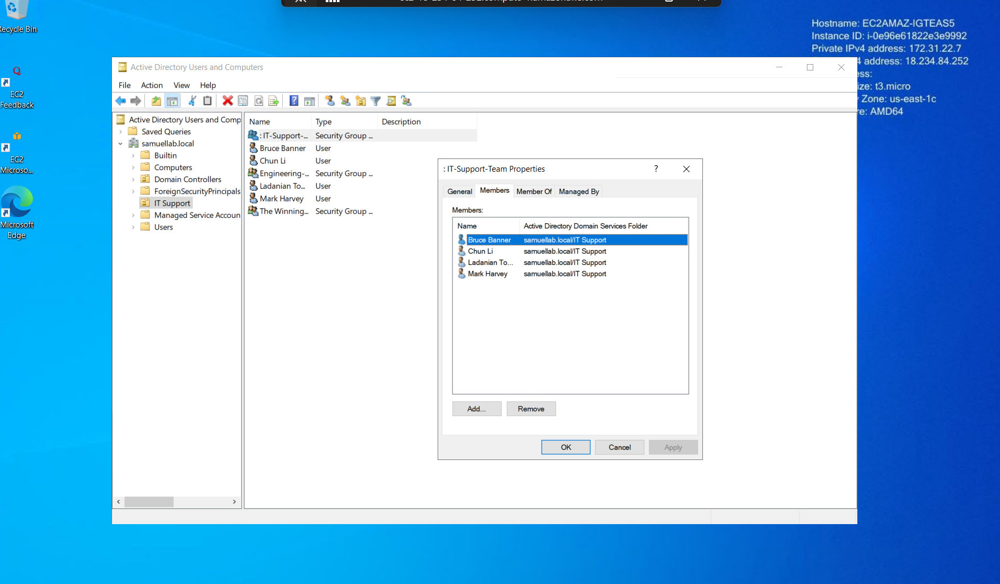
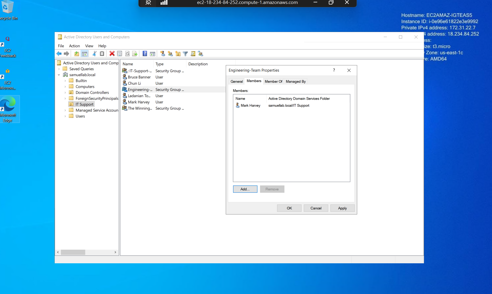
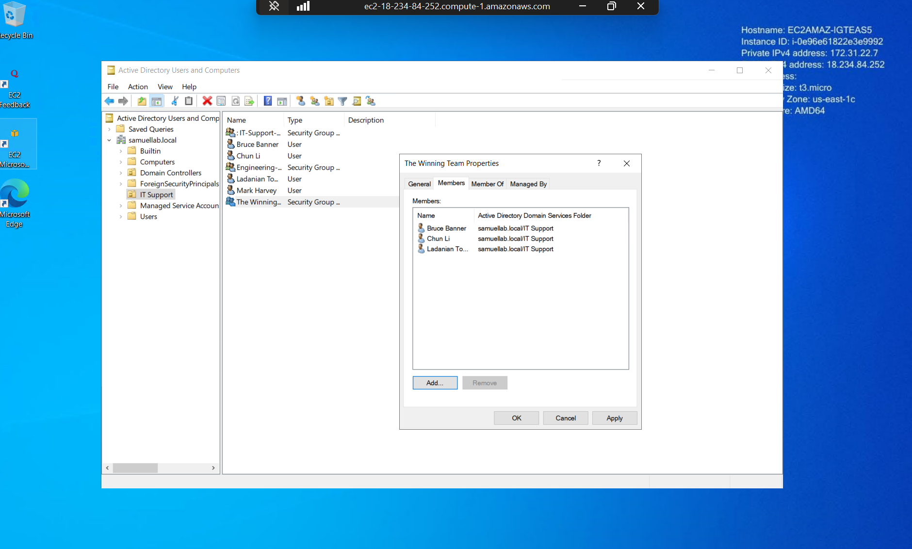
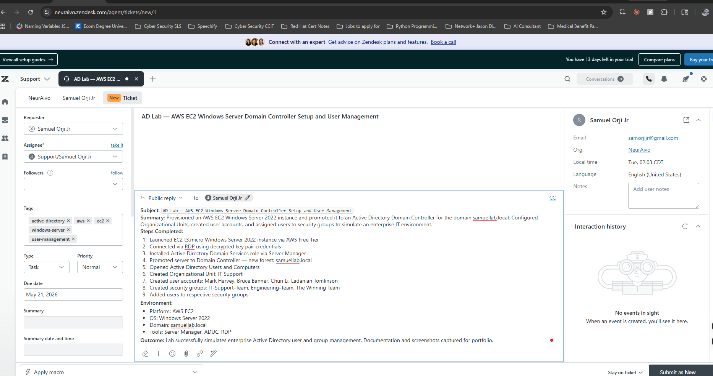

# AWS EC2 Active Directory Home Lab

**Platform:** Amazon Web Services (AWS)
**OS:** Windows Server 2022
**Domain:** samuellab.local
**Tools:** EC2, RDP, Server Manager, AD DS, ADUC, Zendesk

---

## Overview

Provisioned a Windows Server 2022 instance on AWS EC2 Free Tier and 
promoted it to a fully functioning Active Directory Domain Controller. 
Connected remotely via RDP, installed Active Directory Domain Services, 
and built out a working directory structure simulating a real enterprise 
IT environment — no pre-built VM, no guided sandbox.

---

## What Was Built

- Launched EC2 t3.micro Windows Server 2022 instance (Free Tier)
- Connected via RDP using decrypted key pair credentials
- Installed Active Directory Domain Services via Server Manager
- Promoted server to Domain Controller — new forest: samuellab.local
- Created Organizational Unit: IT Support
- Created user accounts: Mark Harvey, Bruce Banner, Chun Li, Ladanian Tomlinson
- Created security groups: IT-Support-Team, Engineering-Team, The Winning Team
- Added users to respective security groups
- Documented full process as a formal support ticket in Zendesk

---

## Troubleshooting Encountered

| Issue | Resolution |
|---|---|
| RDP connection dropped mid-install | Waited for server reboot cycle to complete, reconnected |
| Error code 0x108 on reconnect | Closed RDP, waited 2-3 minutes, reopened fresh session |
| DNS delegation warning during DC promotion | Confirmed expected behavior in new forest — no parent zone exists |

---

## Screenshots

| File | Description |
|---|---|
**AD-Lab_01 — ADUC Dashboard**

**AD-Lab_02 — OU Created**

**AD-Lab_03 — User Accounts Created**

**AD-Lab_04 — Security Groups Created**

**AD-Lab_05 — Users Added to IT Support Team**

**AD-Lab_06 — Users Added to Engineering Team**

**AD-Lab_07 — Users Added to Winning Team**

**AD-Lab_08 — Zendesk Ticket Documented**

---

## Skills Demonstrated

- Cloud infrastructure provisioning (AWS EC2)
- Remote server administration (RDP)
- Active Directory domain configuration
- Organizational Unit and user account management
- Security group creation and membership management
- IT support ticket documentation (Zendesk)
- Independent troubleshooting under real error conditions

---

## Author

**Samuel Orji Jr.**
[LinkedIn](https://www.linkedin.com/in/samuelorjijr/) | 
[Portfolio](https://brainy-maraca-837.notion.site/Samuel-Orji-Jr-Technical-Support-Professional-CompTIA-Se-2e1be178cc8b80c38c2cdcce130175cd)
